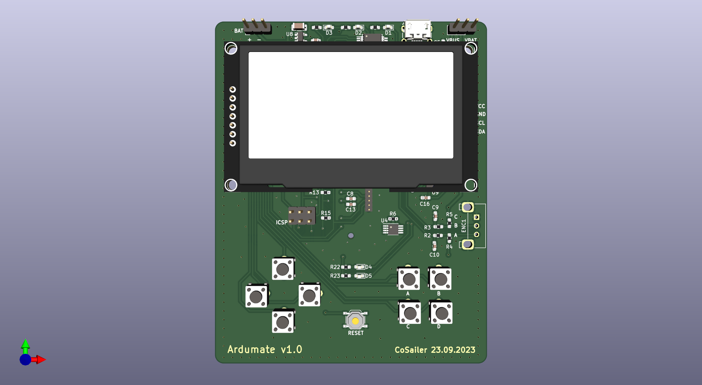
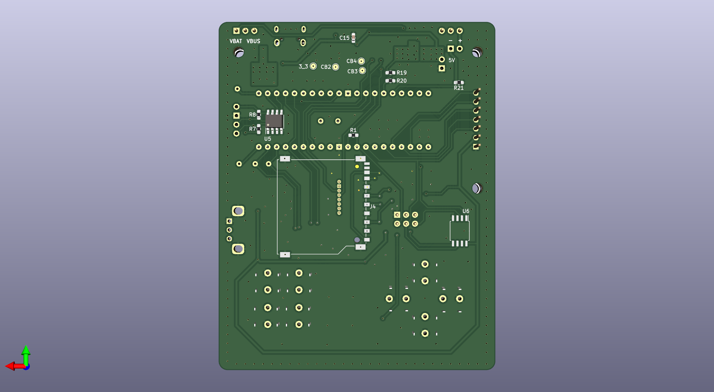

# ardumate
this is a bigger arduboy clone with more features, the has not been reviewed and may contain potential issues, please use at your discretion.

**specification:**\
mcu: atmega1284p\
usb-serial:ft232r\
width:78.74mm\
height:99.06mm

compared with original arduboy, the major differences are:\

1, display:2.42 OLED\
2, mcu: atmega1284p(DIP), 128 KB flash, 4 KB EEPROM, 16 KB SRAM\
3, Sensors: ds18b20, H3LIS331\
4, a 24-serie I2C eeprom and a 25-serie flash\
5, inputs: 8 buttons instead of 4\
6, additional place for an encoder\
7, socket for a nRF24L01 module\
8, use ftdi ft232r usb serial to connect to PC\
9, SD card slot\
10, USB stack removed for arduboy library\

